# Career Guidance Web App

A full-stack web application built with **Firebase Authentication**, **Firestore Database**, and **Hosting**.  

Live Demo: https://careerguidance-66688.web.app

---
The platform supports **student signups**, **college registrations**, **role-based access (student/college/admin)**, and **logging actions** for auditing.  

---

## Features

- **User Authentication**
  - Signup & Login with Firebase Auth
  - Password reset via email
  - Role-based registration (Student / College)

- **College Management**
  - Colleges can register with details
  - Stored under `colleges` collection in Firestore

- **Students**
  - Students can sign up & log in
  - Access dashboard & resources

- **Admin**
  - Role field (`role: admin`) can be assigned in Firestore
  - Admins can manage users, colleges, and logs

- **Logging System**
  - Every action (login, signup, college registration, etc.) stored in `logs` collection

- **Inline Messages (No Alerts 🚫)**
  - Success/error messages displayed under forms with styled messages

---

## Tech Stack

- **Frontend:** HTML, CSS, JavaScript (Vanilla)
- **Backend:** Firebase Authentication & Firestore
- **Hosting:** Firebase Hosting / Netlify
- **Database:** Firestore (NoSQL)


---

## Setup Instructions

### 1. Clone the Repository
```bash
git clone https://github.com/22BCE8093-Eswar/Career-Guidance
cd Career-Guidance
````

### 2. Setup Firebase

Go to Firebase Console.

Create a new project.

Enable Authentication → Email/Password.

Create Firestore Database (start in test mode).

Copy your Firebase SDK config.

Replace contents of js/firebaseConfig.js:

````
// firebaseConfig.js
import { initializeApp } from "https://www.gstatic.com/firebasejs/9.23.0/firebase-app.js";
import { getAuth } from "https://www.gstatic.com/firebasejs/9.23.0/firebase-auth.js";
import { getFirestore } from "https://www.gstatic.com/firebasejs/9.23.0/firebase-firestore.js";

const firebaseConfig = {
  apiKey: "YOUR_API_KEY",
  authDomain: "YOUR_PROJECT.firebaseapp.com",
  projectId: "YOUR_PROJECT_ID",
  storageBucket: "YOUR_PROJECT.appspot.com",
  messagingSenderId: "YOUR_SENDER_ID",
  appId: "YOUR_APP_ID"
};

const app = initializeApp(firebaseConfig);
export const auth = getAuth(app);
export const db = getFirestore(app);
````

### 3. Run Locally

You can use any local server (e.g. VS Code Live Server or Python).

````
# using python
python -m http.server 5000
````
Then open: http://localhost:5000

### 4. Deploy
**Firebase Hosting:**
````
npm install -g firebase-tools
firebase login
firebase init hosting
firebase deploy
````
----

### Screenshots
<table>
  <tr>
    <th> Index Page</th>
    <th> Student SignUp Page</th>
    <th> Student SignIn Page</th>
  </tr>
  <tr>
    <td> </td>
    <td>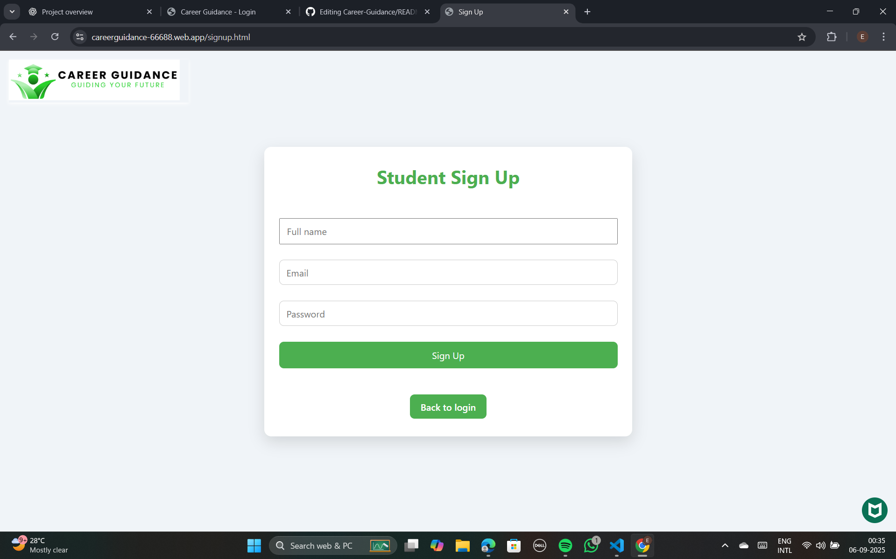 </td>
    <td>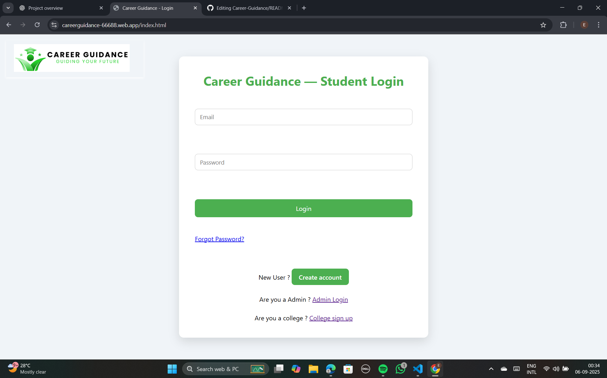 </td>
  </tr>
</table>

<table>
  <tr>
    <th> Admin SignUp Page</th>
    <th> Admin SignIn Page</th>
    <th> College SignUp Page</th>
  </tr>
  <tr>
    <td>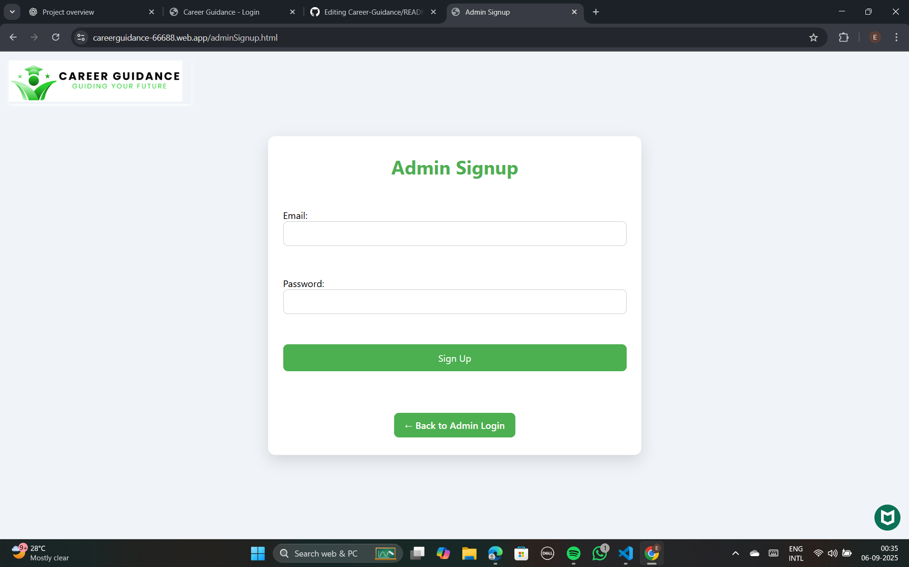 </td>
    <td>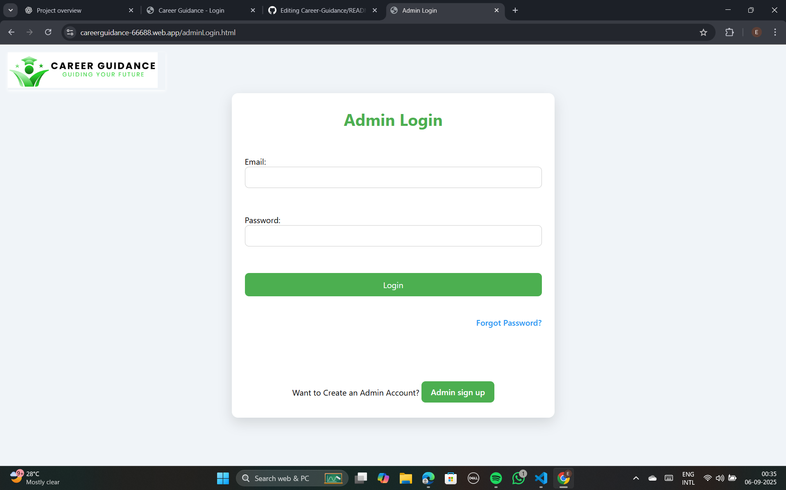 </td>
    <td>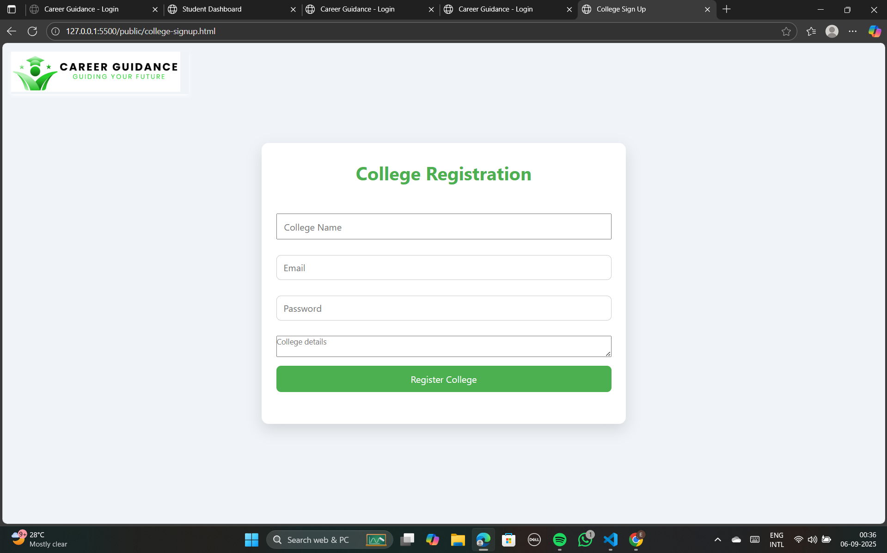 </td>
  </tr>
</table>

<table>
  <tr>
    <th> Dashboard Page</th>
    <th> Field of Intrest</th>
    <th> Location Page</th>
  </tr>
  <tr>
    <td>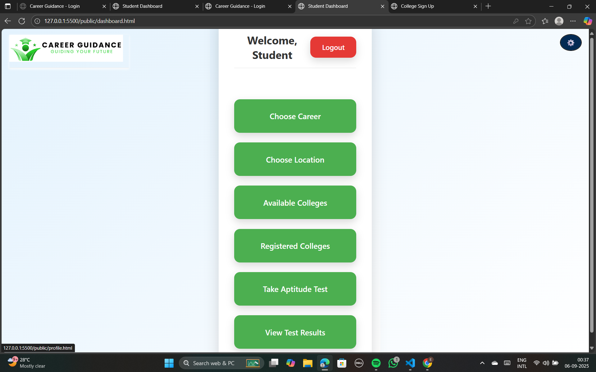 </td>
    <td>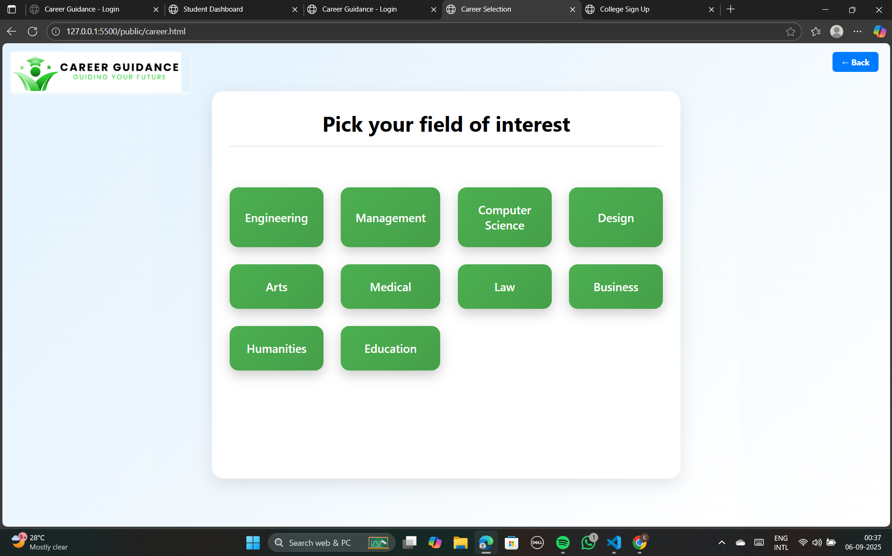 </td>
    <td>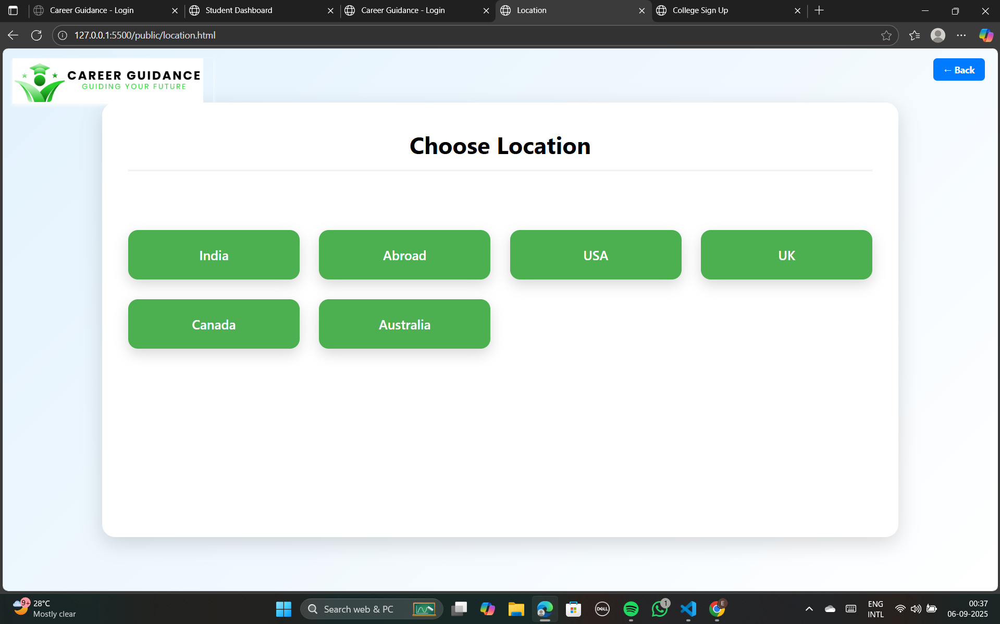 </td>
  </tr>
</table>

<table>
  <tr>
    <th> Available Colleges</th>
    <th> Registerd Colleges</th>
    <th> Aptitude Test Page</th>
  </tr>
  <tr>
    <td>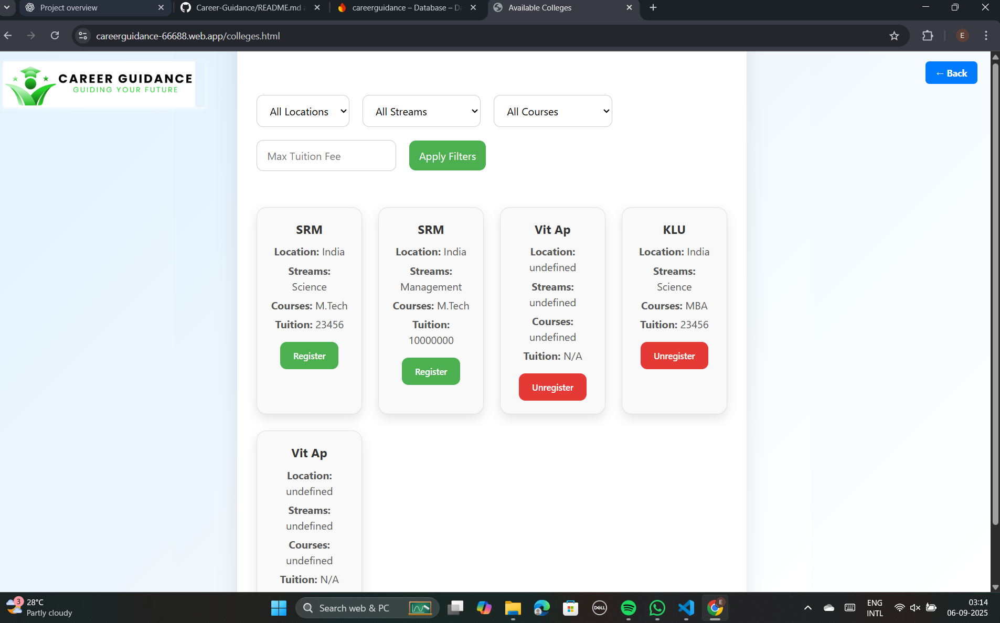 </td>
    <td>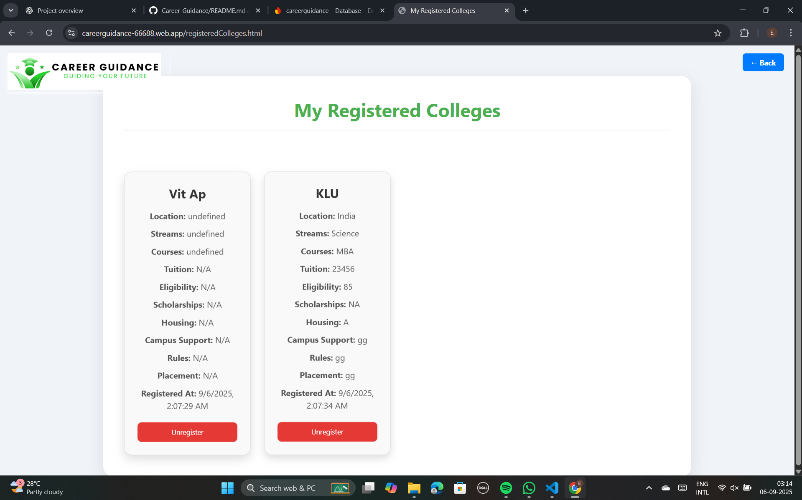 </td>
    <td>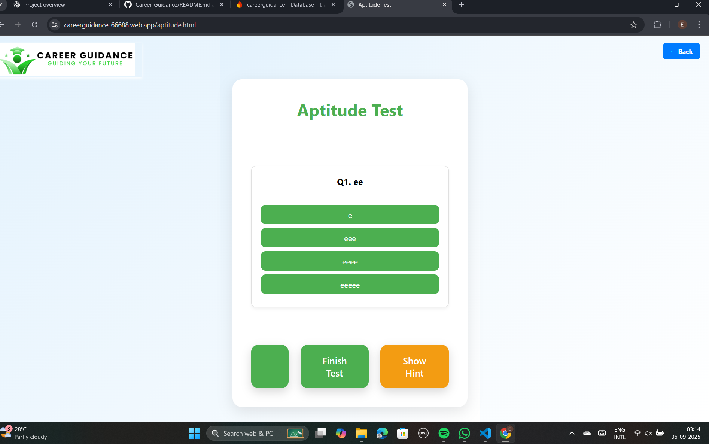 </td>
  </tr>
</table>

<table>
  <tr>
    <th> Results Page</th>
    <th> Profile Page</th>
  </tr>
  <tr>
    <td>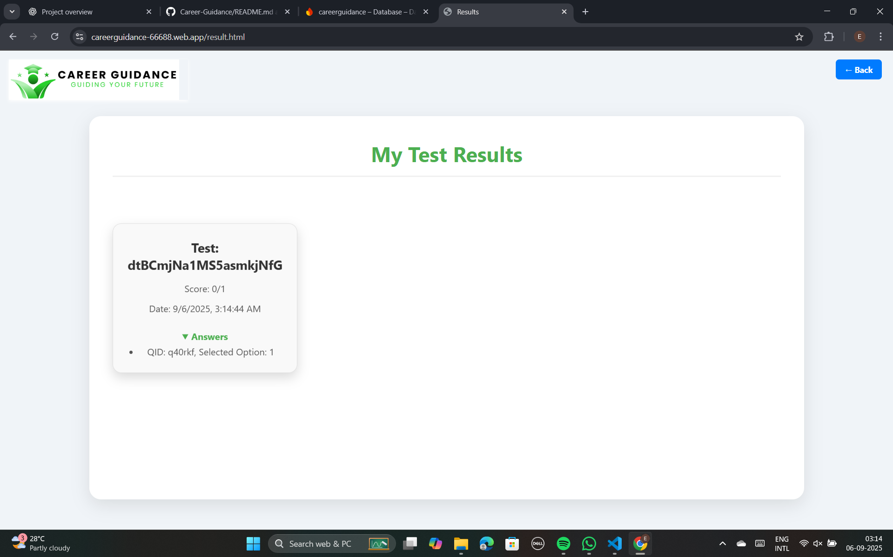 </td>
    <td>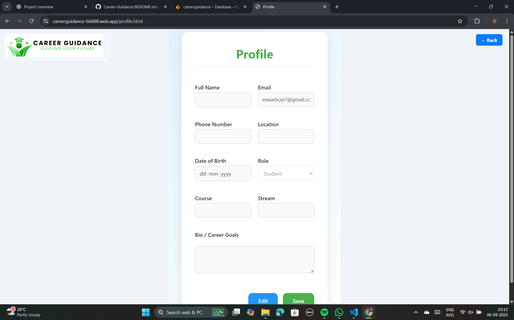 </td>
  </tr>
</table>

<table>
  <tr>
    <th> Logs Page</th>
    <th> Manage Colleges Page</th>
    <th> Create Test Page</th>
  </tr>
  <tr>
    <td>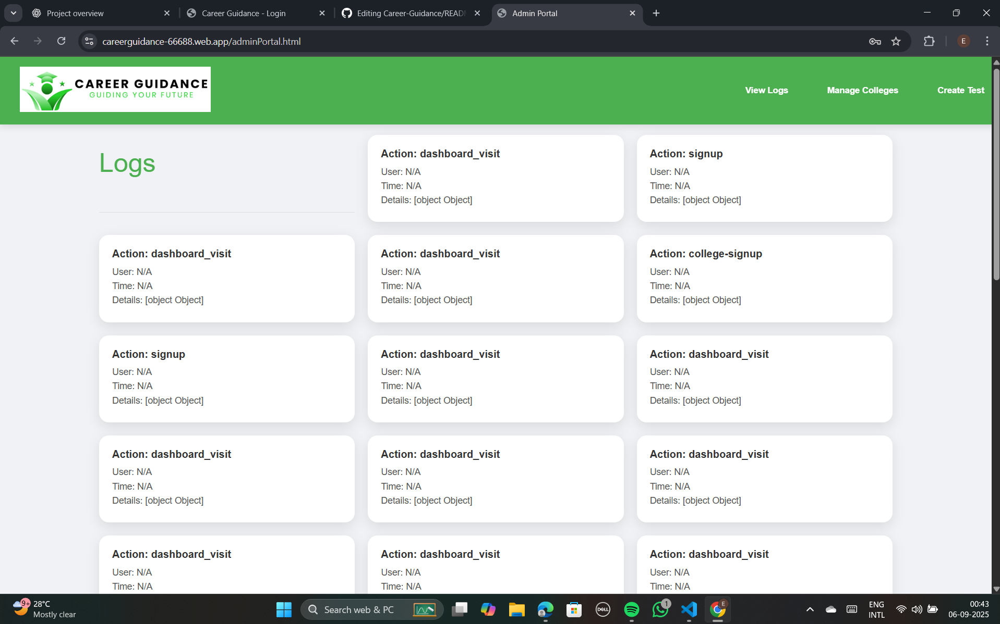 </td>
    <td>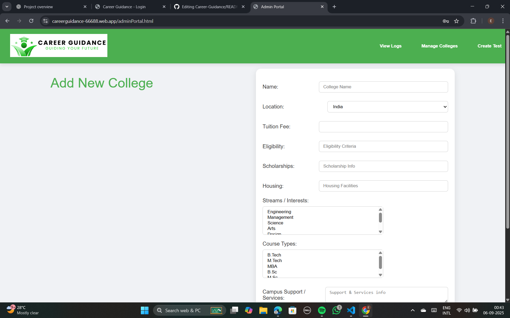 </td>
    <td>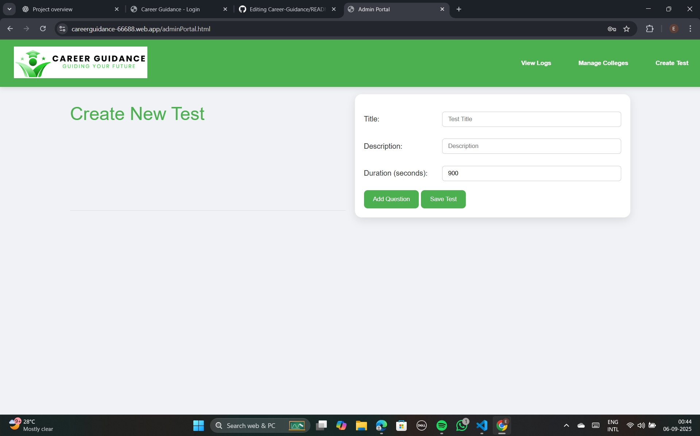 </td>
  </tr>
</table>
---

**Firestore Rules**

Update Firestore Security Rules (basic version):
````
rules_version = '2';
service cloud.firestore {
  match /databases/{database}/documents {

    // Users can read/write their own profile
    match /users/{userId} {
      allow read, update, delete: if request.auth != null && request.auth.uid == userId;
      allow create: if request.auth != null;
    }

    // Colleges collection
    match /colleges/{collegeId} {
      allow read: if true;
      allow write: if request.auth != null && request.auth.uid == collegeId;
    }

    // Logs (any authenticated user can write)
    match /logs/{logId} {
      allow create: if request.auth != null;
      allow read: if request.auth != null;
    }
  }
}

````
**Usage**

Visit /signup.html → Create student account.

Visit /college-signup.html → Register college.

Visit /index.html → Login (student or college).

After login → Redirects to dashboard.html.

All actions are logged under logs collection.

### Author

Built by Eswar Reddy Boyi 

email: eswarboyi7@gmail.com


